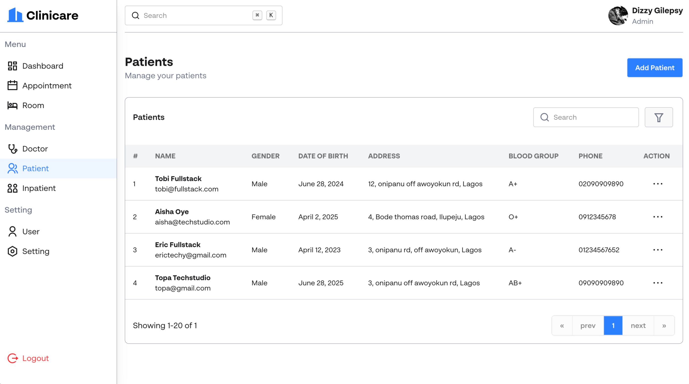

# Clinicare - Hospital Management System

A comprehensive, modern hospital management system built with React and Node.js that streamlines healthcare operations, patient care, and administrative tasks.



## 🏥 Overview

Clinicare is a full-stack hospital management system designed to modernize healthcare facilities by providing digital solutions for patient management, appointment scheduling, billing, and administrative operations. The system serves multiple user types including patients, doctors, nurses, and administrators.

## ✨ Key Features

### 🎯 Core Functionality
- **Patient Management**: Complete patient registration, medical records, and health information tracking
- **Appointment Scheduling**: Online booking system with real-time availability and automated confirmations
- **Doctor & Department Management**: Staff scheduling, departmental organization, and resource allocation
- **Room Management**: Hospital room allocation and availability tracking
- **Inpatient Management**: Comprehensive inpatient care tracking and management
- **Payment Processing**: Integrated billing system with Paystack payment gateway
- **Analytics Dashboard**: Real-time insights into operations, revenue, and performance metrics

### 🔐 User Roles & Access
- **Patients**: Book appointments, view medical records, make payments
- **Doctors**: Manage patients, view appointments, update medical records
- **Nurses**: Patient care management, vital signs tracking, schedule management
- **Administrators**: Full system access, user management, analytics, system configuration

### 🛡️ Security & Authentication
- JWT-based authentication with refresh tokens
- Role-based access control (RBAC)
- Email verification system
- Password reset functionality
- Secure file uploads with Cloudinary integration

## 🚀 Technology Stack

### Frontend (Client)
- **React 18** - Modern UI library with hooks and functional components
- **Vite** - Fast build tool and development server
- **React Router 7** - Client-side routing with lazy loading
- **Tailwind CSS 4** - Utility-first CSS framework
- **DaisyUI** - Component library for Tailwind CSS
- **React Hook Form** - Form handling with validation
- **Zod** - Schema validation
- **TanStack Query** - Data fetching and caching
- **Axios** - HTTP client for API requests
- **React Paystack** - Payment integration
- **Sonner** - Toast notifications
- **Day.js** - Date manipulation

### Backend (Server)
- **Node.js** - JavaScript runtime
- **Express.js 5** - Web application framework
- **MongoDB** - NoSQL database with Mongoose ODM
- **JWT** - Authentication and authorization
- **Bcrypt** - Password hashing
- **Cloudinary** - Image and file storage
- **Nodemailer** - Email services
- **Express Rate Limit** - API rate limiting
- **Morgan** - HTTP request logger
- **Node Cache** - In-memory caching
- **Zod** - Request validation

### Development Tools
- **ESLint** - Code linting and formatting
- **Vercel** - Deployment platform
- **Git** - Version control

## 📁 Project Structure

```
clinicare/
├── client/                 # React frontend application
│   ├── public/            # Static assets
│   ├── src/
│   │   ├── api/           # API service functions
│   │   ├── components/    # Reusable UI components
│   │   ├── features/      # Feature-specific components
│   │   ├── hooks/         # Custom React hooks
│   │   ├── layouts/       # Layout components
│   │   ├── pages/         # Page components
│   │   ├── routes/        # Routing configuration
│   │   ├── store/         # State management
│   │   └── utils/         # Utility functions
│   ├── package.json
│   └── vite.config.js
├── server/                # Node.js backend application
│   ├── src/
│   │   ├── controllers/   # Request handlers
│   │   ├── middlewares/   # Custom middleware
│   │   ├── models/        # Database models
│   │   ├── routes/        # API routes
│   │   ├── services/      # Business logic
│   │   └── utils/         # Utility functions
│   ├── index.js           # Server entry point
│   └── package.json
└── ReadMe.md
```

## 🛠️ Installation & Setup

### Prerequisites
- Node.js (v18 or higher)
- MongoDB (local or cloud instance)
- Git

### Environment Variables

Create `.env` files in both `client/` and `server/` directories:

#### Server Environment Variables
```env
# Database
MONGODB_URI=mongodb://localhost:27017/clinicare
MONGODB_DB_NAME=clinicare

# JWT
JWT_SECRET=your_jwt_secret_key
JWT_EXPIRES_IN=7d
JWT_REFRESH_SECRET=your_refresh_secret_key
JWT_REFRESH_EXPIRES_IN=30d

# Email Configuration
EMAIL_HOST=smtp.gmail.com
EMAIL_PORT=587
EMAIL_USER=your_email@gmail.com
EMAIL_PASS=your_app_password

# Cloudinary
CLOUDINARY_CLOUD_NAME=your_cloud_name
CLOUDINARY_API_KEY=your_api_key
CLOUDINARY_API_SECRET=your_api_secret

# Paystack
PAYSTACK_SECRET_KEY=your_paystack_secret_key
PAYSTACK_PUBLIC_KEY=your_paystack_public_key

# Server
PORT=5400
NODE_ENV=development
```

#### Client Environment Variables
```env
VITE_API_URL=http://localhost:5400/api/v1
VITE_PAYSTACK_PUBLIC_KEY=your_paystack_public_key
```

### Installation Steps

1. **Clone the repository**
   ```bash
   git clone <repository-url>
   cd clinicare
   ```

2. **Install server dependencies**
   ```bash
   cd server
   npm install
   ```

3. **Install client dependencies**
   ```bash
   cd ../client
   npm install
   ```

4. **Start the development servers**

   **Terminal 1 - Start the backend server:**
   ```bash
   cd server
   npm run dev
   ```

   **Terminal 2 - Start the frontend development server:**
   ```bash
   cd client
   npm run dev
   ```

5. **Access the application**
   - Frontend: http://localhost:4800
   - Backend API: http://localhost:5400

## 🎯 Usage

### Getting Started

1. **Register as a new user** at `/account/signup`
2. **Verify your email** using the verification code sent to your email
3. **Complete patient onboarding** with your health information
4. **Access the dashboard** to manage appointments, view records, and more

### Key User Flows

#### For Patients:
1. Sign up and verify account
2. Complete health profile setup
3. Book appointments with available doctors
4. View appointment history and medical records
5. Make payments for services

#### For Healthcare Providers:
1. Access admin dashboard
2. Manage patient records
3. Schedule and update appointments
4. Track inpatient care
5. Generate reports and analytics

#### For Administrators:
1. Manage user accounts and roles
2. Configure hospital settings
3. Monitor system analytics
4. Manage rooms and resources
5. Oversee payment processing

## 🔧 API Documentation

### Authentication Endpoints
- `POST /api/v1/auth/register` - User registration
- `POST /api/v1/auth/login` - User login
- `POST /api/v1/auth/refresh` - Refresh access token
- `POST /api/v1/auth/logout` - User logout
- `POST /api/v1/auth/verify-account` - Email verification
- `POST /api/v1/auth/forgot-password` - Password reset request
- `POST /api/v1/auth/reset-password` - Password reset

### Core API Endpoints
- **Patients**: `/api/v1/patients/*`
- **Appointments**: `/api/v1/appointments/*`
- **Doctors**: `/api/v1/doctors/*`
- **Rooms**: `/api/v1/rooms/*`
- **Payments**: `/api/v1/payments/*`
- **Inpatients**: `/api/v1/inpatients/*`
- **Dashboard**: `/api/v1/dashboard/*`

## 🚀 Deployment

### Frontend Deployment (Vercel)
1. Connect your GitHub repository to Vercel
2. Set environment variables in Vercel dashboard
3. Deploy automatically on push to main branch

### Backend Deployment
1. Deploy to your preferred hosting service (Railway, Render, etc.)
2. Set environment variables
3. Ensure MongoDB connection is configured
4. Update CORS settings for production domain

## 🤝 Contributing

1. Fork the repository
2. Create a feature branch (`git checkout -b feature/amazing-feature`)
3. Commit your changes (`git commit -m 'Add some amazing feature'`)
4. Push to the branch (`git push origin feature/amazing-feature`)
5. Open a Pull Request

## 📝 License

This project is licensed under the MIT License - see the [LICENSE](LICENSE) file for details.

## 🆘 Support

For support, email support@clinicare.com or create an issue in the repository.

## 🙏 Acknowledgments

- React team for the amazing framework
- Tailwind CSS for the utility-first CSS framework
- MongoDB for the flexible database solution
- All contributors and users of Clinicare

---

**Clinicare** - Transforming Healthcare Management, One Hospital at a Time. 🏥✨
